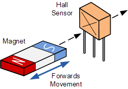
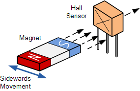
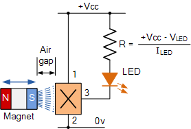

#  ESP32-HALL sensor

****
## Oписание

Използвани пинове **GPIO36** и **GPIO39**, които са част от **ADC1**, съответно `ADC_channel_0` и `ADC_channel_3`.
Когато изпозвате датчикът на хол игнорирайте входните сигнали на тези пинове

****
##  Приложение

[**Hall Effect Applications**](https://www.electronics-tutorials.ws/electromagnetism/hall-effect.html)

Hall effect sensors are activated by a magnetic field and in many applications the device can be operated by a single permanent magnet attached to a moving shaft or device. There are many different types of magnet movements, such as “Head-on”, “Sideways”, “Push-pull” or “Push-push” etc sensing movements.

Which every type of configuration is used, to ensure maximum sensitivity the magnetic lines of flux must always be perpendicular to the sensing area of the device and must be of the correct polarity.

**** 

This head-on positional detector will be “OFF” when there is no magnetic field present, (0 gauss). When the permanent magnets south pole (positive gauss) is moved perpendicular towards the active area of the Hall effect sensor the device turns “ON” and lights the LED. Once switched “ON” the Hall effect sensor stays “ON”.

To turn the device and therefore the LED “OFF” the magnetic field must be reduced to below the release point for unipolar sensors or exposed to a magnetic north pole (negative gauss) for bipolar sensors. The LED can be replaced with a larger power transistor if the output of the Hall Effect Sensor is required to switch larger current loads.