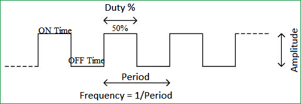

# ESP32-IDF
LED Controller with 16 channels

- 8 channels in high speed mode
- 8 channels in low speed mode

LEDC channels are divided into two groups of 8 channels each. One group of LEDC channels operates in high speed mode. This mode is implemented in hardware and offers automatic and glitch-free changing of the PWM duty cycle. The other group of channels operate in low speed mode, the PWM duty cycle must be changed by the driver in software.


Setting up a channel of the LEDC in either high or low speed mode is done in three steps:

1. **Timer Configuration** by specifying the PWM signal’s frequency and duty cycle resolution.

2. **Channel Configuration** by associating it with the **timer and GPIO** to output the PWM signal.

3. **Change PWM Signal** that drives the output in order to change LED’s intensity. This can be done under the full control of software or with hardware fading functions.

###  **1. Timer Configuration**

The frequency and the duty resolution are interdependent. The higher the PWM frequency, the lower the duty resolution which is available, and vice versa.

 *Commonly­used Frequencies and Resolutions*

|LEDC Clock Source| LEDC Output (PWM) Frequency |Highest Resolution|
|---|---|---|
|APB_CLK (80 MHz)| 1 kHz  | 1/65536 (16 bit)
APB_CLK (80 MHz)| 5 kHz | 1/8192 (13 bit)
APB_CLK (80 MHz)| 10 kHz |1/4096  (12 bit)
RTC8M_CLK (8 MHz) |1 kHz | 1/4096 (12 bit)
RTC8M_CLK (8 MHz)| 8 kHz | 1/512(9 bit)
|REF_TICK (1 MHz) |1 kHz |1/512 (9 bit)|


### **2. Channel Configuration**


# ESP32-Arduino core

## Основи ШИМ PWM


- **duty cycle** 
  
  the ratio of the time that the signal is in a high(on) state over the total time it takes to complete one cycle

    |voltage amplitude|duty cycle|output voltage |
    |----|---|----|
    3.3V |100 %| 3.3 V|
    3.3V |75 %| 2.475 V|
    3.3V |50 %| 1.65 V|
    3.3V |25 %| 0.85 V|
    3.3V |0 %| 0.0 V|

   - **resolution**
   
    |resolution|values as unit|duty cycle range| duty cycle value in unit at 50% |
    |--|--|--|--|
    16 bit|1- 65536| 0-100 %|32768
    13 bit |1-8192| 0-100 %| 4096
    12 bit|1-4096| 0-100 %|2048
    |10 bit|1-1024| 0-100 %|512
    |8 bit| 1-256| 0-100 %|128
  
- **frequency / period**
  
    It determines the speed at which the PWM completes one cycle, which means the speed at which the signal switches between high and low states. If we turn the digital signal on and off repeatedly with a high enough frequency, the output will behave like an analogue signal with a constant voltage.

- **resolution**
   
    |resolution|values as unit|duty cycle range| duty cycle value in unit at 50% |
    |--|--|--|--|
    16 bit|1- 65536| 0-100 %|32768
    13 bit |1-8192| 0-100 %| 4096
    12 bit|1-4096| 0-100 %|2048
    |10 bit|1-1024| 0-100 %|512
    |8 bit| 1-256| 0-100 %|128

## Приложения на ШИМ
- **Adjust Brightness of Screen using PWM**

For PWM, adjusting the brightness of the screen does not rely on the power but by alternating on and off of the screen. When the PWM dimming screen is lit, it does not continuously emit light, but it constantly lights up and turns off the screen. If this changes fast enough, our eyes treat is as always on but with different brightness based on different duty cycles. The larger the duty cycle, the brighter the screen.

## използване

``` c
const int ledPin = 2;
const uint8_t channel = 8;
const double freq = 10000; 
const uint8_t pwmResolution = 12;

void setup(){
    ledcSetup(channel,freq,pwmResolution);
    ledcAttachPin(ledPin,channel);
    Serial.begin(9600);
}
void loop(){

    for (int i = 0; i < 4095; i++)
    {
        ledcWrite(channel,i);
        delay(1);
    }
    delay(1000);
    for (int i = 4095; i > 0; i--)
    {
        ledcWrite(channel,i);
        delay(1);
    }
    delay(1000);
}
```
### основни функции
``` c
double ledcSetup(uint8_t chan, double freq, uint8_t bit_num)
```
  - `uint8_t chan`  избиране на канал от LEDC драйвера 0-15
  - `double freq` честота на запълване
  - `uint8_t bit_num` резолюция на ШИМ 0-16 bit

*препоръчителни стойности*
| честота |най-висока резолюция|
|---|---|
 1 kHz  | 1/65536 (16 bit)
 5 kHz | 1/8192 (13 bit)
 10 kHz |1/4096  (12 bit)

``` c
void ledcAttachPin(uint8_t pin, uint8_t chan)
```
```c
void ledcWrite(uint8_t chan, uint32_t duty)
```