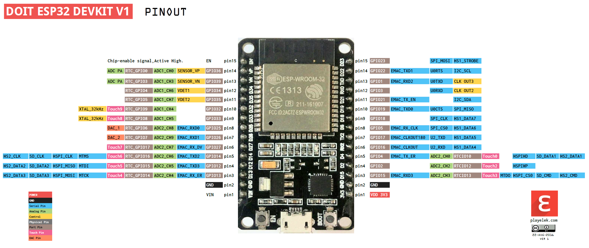

# Референция GPIOs

## Развойна платка ***ESP32-101-board***
### Таблица GPIOs 101-board

Връзки на периферните модули от развойната платка към микроконтролера:
???+ summary "GPIOs за развойна платка ESP32-101-board"

    | **GPIO  / ESP32 pin** | **Периферен  Модул** | **Описание**                                                 | **Използван  режим** |
    | :---------------------: | :--------------------: | :------------------------------------------------------------: | :--------------------: |
    | `GPIO2`  / `D2`               | LED-G/PO2            | Зелен  светодиод /  транзисторен  изход 2                    | Digital Output, PWM  |
    | `GPIO4`  / `D4`               | LED-R/PO1            | Червен  светодиод /  транзисторен  изход 1                   | Digital Output, PWM  |
    | `GPIO5`  / `D5`               | <свободен>           | Няма  конкретна  функция в ESP32-101-board                   | -                    |
    | `GPIO12` / `D12`              | ENC-SW               | Бутон на  ротационния  енкодер                               | Digital Input        |
    | `GPIO13` / `D13`              | ENC-A                | Сигнал “A” на ротационния  енкодер                           | Digital Input        |
    | `GPIO14` / `D14`              | ENC-B                | Сигнал “B” на  ротационния  енкодер                          | Digital Input        |
    | `GPIO15` / `D15`              | BATT                 | Измерване  на нивото на  батерията  (при захранване  през  куплунг “POWER”) | Analog Input         |
    | `GPIO16` / `RX2`              | IR-RX                | Инфра-червен  приемник (демодулатор,  38 kHz)                | Digital Input        |
    | `GPIO17` / `TX2`              | IR-TX                | Инфра-червен  излъчвател  (светодиод)                        | Digital Output       |
    | `GPIO18` / `D18`              | SW2                  | Бутон “SW2”                                                  | Digital Input        |
    | `GPIO19` / `D19`              | SW1                  | Бутон “SW1”                                                  | Digital Input        |
    | `GPIO21` / `D21`              | I2C-SDA              | Комуникационен  интерфейс “I2C” – даннова  линия             | I2C-SDA              |
    | `GPIO22` / `D22`              | I2C-SCL              | Комуникационен  интерфейс “I2C” – тактова  линия             | I2C-SCL              |
    | `GPIO23` / `D23`              | JOY-SW               | Бутон на  джойстика                                          | Digital Input        |
    | `GPIO25` / `D25`              | LED-B/PO3            | Син  светодиод /  транзисторен  изход 3                      | Digital Output, PWM  |
    | `GPIO26` / `D26`              | PB                   | Пиезо-зумер                                                  | PWM                  |
    | `GPIO27` / `D27`              | TS1                  | Сензор за  допир “TS1”                                       | TOUCH                |
    | `GPIO32` /  `D32`             | TS3                  | Сензор за  допир “TS3”                                       | TOUCH                |
    | `GPIO33` /  `D33`             | TS2                  | Сензор за  допир “TS2”                                       | TOUCH                |
    | `GPIO34` / `D34`              | PT                   | Сензор за  светлина  (фото-транзистор  )                     | Analog Input         |
    | `GPIO35` / `D35`              | TMP                  | Сензор за  температура (MCP9701)                             | Analog Input         |
    | `GPIO36` / `VP`               | JOY-Y                | Ос “Y” на  джойстика                                         | Analog Input         |
    | `GPIO39` / `VN`               | JOY-X                | Ос “X” на  джойстика                                         | Analog Input         |      

### Забележки към GPIOs 101-board

??? info "I2C"

	`I2C` e комуникационен интерфейс за свързване на различни специализирани модули към микроконтролера. Към пинове `I2C-SDA` и `I2C-SCL` са свързани дисплея, жироскопа и допълнителната памет. Отделно могат да се добавят и още външни модули, като за това се използва куплунг `I2C` в горния ляв край на ESP32-101-board.  За да се различават устройствата, всяко има уникален адрес:
	
	* **LCD дисплей** – `0x3C`
	* **Жироскоп** – `0x68`
	* **Външна памет** – `0x50`

??? info "Ротационен енкодер"

	Сигналите Encoder-A  и Encoder-B се използват за определяне посоката на въртене на ротационния енкодер. И двата пина имат заложени pull-up резистори и филтрови кондензатори на платката.

??? info "Бутони" 

    3.       Пиновете, към които са свързани бутоните (SW1, SW2, ENC-SW, JOY-SW), нямат заложени pull-up резистори – необходимо е да се използват софтуерните такива! Също така нямат заложени филтрови кондензатори – за целта се прилагат софтуерни техники за филтриране трептенията на контактите.

###   Електрическа схема

Електрическа схема на развойната платка може да изтеглите като PDF от [тук ]()или да запазите снимката по-долу:

## Микроконтролер ЕSP32
### Таблица GPIOs

???+ summary "Таблица GPIOs"

    | GPIO / ESP32 | Основни Режими | Важна информация | Вход | Изход |
    | :----: | :----: | :----: | :----: | :----: |
    | 0  / - | `GPIO0` , ADC2_CH1 , TOUCH1  | pull-up; не  е изведен на  пин; свързан  към бутон “BOOT”; извежда  PWM сигнал  при  стартиране  на  контролера | :material-check::material-alert-circle-outline:| :material-check: :material-alert-circle-outline:  |
    | 1  / TX0 | `GPIO1`, UART0_TX  | свързан  към USB-преобразувателя;  извежда debug информация  при  стартиране | :material-close: | :material-close: |
    | 2  / D2 | `GPIO2`, ADC2_CH2, TOUCH2| pull-down | :material-check: :material-alert-circle-outline:| :material-check: |
    | 3  / RX0 | `GPIO3`, UART0_RX| свързан  към USB-преобразувателя; извежда  високо ниво  при  стартиране | :material-close: | :material-close: |
    | 4  / D4 | `GPIO4`, ADC2_CH0, TOUCH0 | pull-down | :material-check: :material-alert-circle-outline:| :material-check: |
    | 5  / D5 | `GPIO5`, VSPI_CS | pull-up; извежда  PWM сигнал  при  стартиране  на  контролера | :material-check: :material-alert-circle-outline:| :material-check: :material-alert-circle-outline:|
    | 6  - 11 | `GPIO6 `- `GPIO11`, `SD`, `SPI,` `UART1` | не са  изведени на  пинове; към  тях е свързана  програмната  (флаш) памет  на  микроконтролера;  не трябва да  се  използват в  потребителската  програма | :material-close: | :material-close: |
    | 12 / D12 | `GPIO12`, ADC2_CH5 , TOUCH5, HSPI_MISO | pull-down; контролерът  не стартира  ако по време  на включване  или рестарт  има високо  ниво | :material-check: :material-alert-circle-outline: | :material-check: |
    | 13 / D13 | `GPIO13`, ADC2_CH4,TOUCH4, HSPI_MOSI |  | :material-check: | :material-check: |
    | 14 / D14 | `GPIO14`, ADC2_CH6, TOUCH6, HSPI_CLK | извежда PWM сигнал  при  стартиране  на  контролера | :material-check: | :material-check::material-alert-circle-outline: |
    | 15 / D15 | `GPIO15`, ADC2_CH3, TOUCH3, HSPI_CS | pull-up;  извежда PWM сигнал  при  стартиране  на  контролера | :material-check: :material-alert-circle-outline:| :material-check: :material-alert-circle-outline: |
    | 16 / RX2 | `GPIO16,` UART2_RX |  | :material-check: | :material-check: |
    | 17 / TX2 | `GPIO17`, UART2_TX | | :material-check: | :material-check: |
    | 18 / D18 | `GPIO18,` VSPI_CLK | | :material-check: | :material-check: |
    | 19 / D19 | `GPIO19`, VSPI_MISO  | | :material-check: | :material-check: |
    | 21 / D21 | `GPIO21`, I2C_SDA | | :material-check: | :material-check: |
    | 22 / D22 | `GPIO22,` I2C_SCL| | :material-check: | :material-check: |
    | 23 / D23 | `GPIO23`, VSPI_MOSI | | :material-check: | :material-check: |
    | 25 / D25 | `GPIO25`, ADC2_CH8, DAC, I2S | | :material-check: | :material-check: |
    | 26 / D26 | `GPIO26`, ADC2_CH9, DAC, I2S | | :material-check: | :material-check: |
    | 27 / D27 | `GPIO27`, ADC2_CH7, TOUCH7, I2S | | :material-check: | :material-check: |
    | 32 / D32 | `GPIO32`, ADC1_CH4, TOUCH9 | | :material-check: | :material-check: |
    | 33 / D33 | `GPIO33`, ADC1_CH5, TOUCH8  | | :material-check: | :material-check: |
    | 34 / D34 | `GPI34`, ADC1_CH6 | само  цифров вход  (не може да  бъде изход);  няма  вътрешни  резистори | :material-check: | :material-close: |
    | 35 / D35 | `GPI35`, ADC1_CH7 | само  цифров вход  (не може да  бъде изход);  няма вътрешни  резистори | :material-check: | :material-close: |
    | 36 / VP | `GPI36`, ADC1_CH0 | само  цифров вход  (не може да  бъде изход);  няма  вътрешни  резистори | :material-check: | :material-close: |
    | 39 / VN | `GPI39`, ADC1_CH3 | само  цифров вход  (не може да  бъде изход);  няма  вътрешни  резистори | :material-check: | :material-close: |
    
    :material-check: използвай спокойно
    
    :material-close: не използвай
    
    :material-check::material-alert-circle-outline: използвай с внимание ,виж забележки   

??? summary "Снимка GPIOs"
	

### Забележки към GPIOs

??? tip "Пинове `GPIO 0, 2, 4, 5, 12, 15`"

	* участват в процеса по стартиране на микроконтролера и е важно в първоначалния момент състоянията им да са както са посочени в таблицата (трябва да се съобрази схемата на свързване когато се използват като входове)! В противен случай микроконтролера няма да започне да изпълнява програмата!

??? tip "Пинове  `GPIO 0, 1, 3, 5, 14, 15`"

	* по време на стартиране на микроконтролера временно се установяват във високо състояние, което може да доведе до нежелателно включване на свързани периферни модули (трябва да се съобрази схемата на свързване когато се използват като изходи)!

??? tip " Пинове `GPIO 34, 35, 36, 39`"

	* не могат да бъдат използвани като изходи! Освен това нямат възможност за включване на вътрешни резистори!

??? tip "Аналогови входове `ADC1` `ADC2`"

	Аналоговите входове от модул `ADC2` (от `ADC2_CH0` до `ADC2_CH9`) не могат да бъдат използвани при включен `WiFi` модул! Аналоговите входове от модул `ADC1` работят винаги!

??? info "Общо за `GPIO`"
	* Всичко пинове, които могат да бъдат използвани като входове, имат и прекъсвания (промяна на ниво или фронт)
	* Всички пинове, които могат да бъдат използвани като изходи, имат и PWM функция (широчинно-импулсна модулация)
