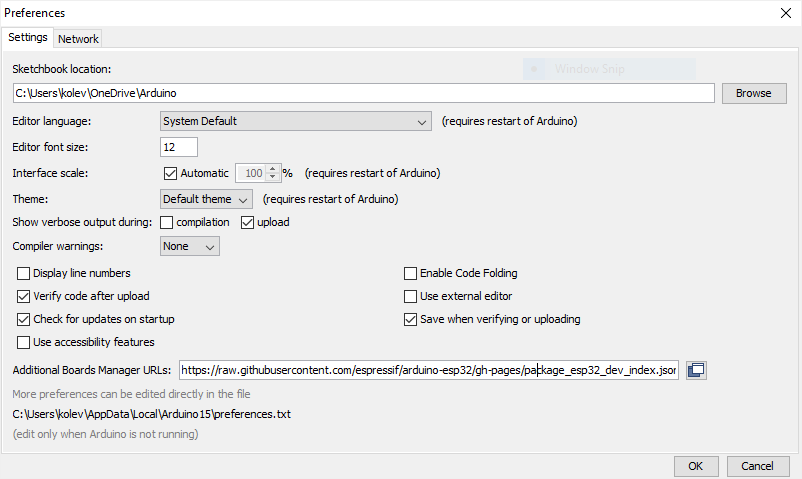

# Arduino IDE + ESP32 Add-on

##  Инсталиране на Arduino IDE

>Има възможности за различни операционни системи, тук проследяваме инсталацията за  Windows и *Arduino IDE 1.8*. Може да изтеглите инсталатор, архив или директно приложение за Windows, съветът ни е изолзвайте инсталатора. Изтеглете най-новата версия на [Arduino IDE](https://www.arduino.cc/en/software "линк към официалния сайт") :


>Следвайте инструкциите на инсталатора, ако не сте инсталира Arduino IDE на вашият компютър, инсталаторът може да поиска записване и някои  драйвери за ардуино микроконтролери, запишете ги не са излишни.

??? info "Скрийншоти"

    { loading=lazy }
    
    { loading=lazy }
    
    { loading=lazy }
    
    { loading=lazy }
    
    { loading=lazy }
    
    { loading=lazy }


## Инсталиране на ESP32 Add-on към Arduino IDE

>След като успешно сте инсталрали най-актуалната версия на Arduino IDE е време да запишете и добавката за контролера ESP32. 


>- избираме `File>Preferences` и в полето **Additional Boards Manager URLs** въвеждаме следния линк и потвърждаваме с бутона `[ ОК ]` 


``` tex
https://dl.espressif.com/dl/package_esp32_index.json
```

???+ info "Preferences"
	{ loading=lazy }

>- избираме `Tools> Board: "Arduino Uno"> Boards Manager...`, което ни отваря мениджъра на възможните контролери, в полето за търсене въвеждаме `esp32` и инсталираме 

???+ info "Boards Manager"

	{ loading=lazy }
	
	{ loading=lazy }
	
## Забележки
!!! warning "Kонфигурация на Arduino IDE"
	За правилна работа с контролера, който е към развойната платка, е нужно **първо** да се избере правилния модул (Board: "ESP32 Dev Module") и **след това** да се приложат следните настройки от менюто `Tools` :
    === "Конфигурация"
        ``` 
        Board: "ESP32 Dev Module"
        Upload Speed: "921600"
        CPU Frequency: "240MHz (Wifi/BT)"
        Flash Frequency: "80 MHz"
        Flash Mode: "QIO"
        Flash Size: "4MB (32Mb)"
        Partition Scheme: "Default 4MB with spiffs (1.2MB App/1.5MB SPIFFS)"
        Code Debug Level: "None"
        PSRAM: "Disabled"
        ```
    === "Снимка"
        { loading=lazy }
    
След като сте готови с инсталацията, може да преминете към [добавяне на библиотеки](libraries.md)
