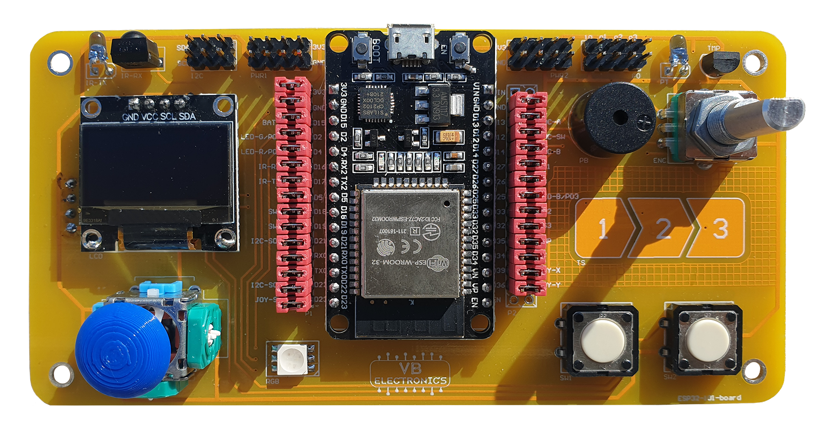

#Добре дошли!

Тук ще намерите [информация](boardInfo.md)  за развойна платка  **ESP32-101-board** базирана на съвременния и широко използван микронтролер ESP32  на фирмата [Espressif](https://www.espressif.com/en/products/socs/esp32). Това е широко популярен контролер в сферата на DIY и IoT проектите. Двуядрен микропроцесор със WiFi и Bluetooth LE 5.0 функционалности позволяващи по-голяма гъвкавост при комуникациите с други устройства в съвременния свят. 

Широкото му приложение в сферата на любителите се дължи на това, че този микроконтролер може да се програмира чрез вече познатата на много хора среда за програмиране Arduino IDE само с [добавянто на един допълнителен  Add-on](ide-install.md). 

Поради това че Arduino IDE не е native средата за програмиране на контролера има много подводни камъни на, които човек може да попадне. Ето защо ние от VB- electronics разработихме развойна платка с помощта на която да се разгледат и опишат, с нагледни примери, използването на повечето функционалности на този контролер чрез Ардуино средата. Разбира се, за да се използват повечето възножностите на контрелара е нужна и периферия, ето тук идва и ползата на **ESP32-101-board** развойна платка "*аут ъф да бокс*", без нужда от бредборд и досадни кабели. 
{ loading=lazy }
{ loading=lazy }

Powered by KODITronix

